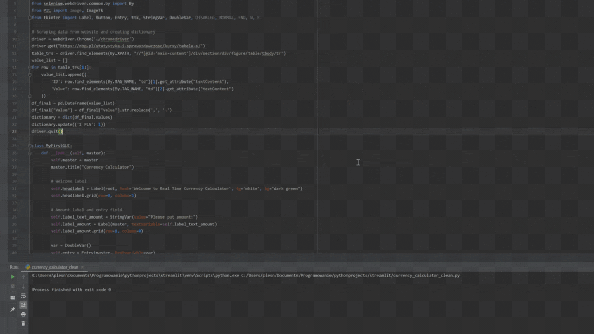

# Currency Converter Calculator

Welcome to the Currency Converter Calculator! This application allows you to convert between various currencies in real-time, using the latest exchange rates from the National Bank of Poland. Built with Python and leveraging web scraping, this tool is both educational and practical for understanding currency conversions.

## Features

- **Real-Time Exchange Rates**: Fetches the latest exchange rates from the National Bank of Poland.
- **User-Friendly Interface**: Simple and intuitive design using Tkinter.
- **Multiple Currency Support**: Supports conversion between multiple currencies.
- **Clear Functionality**: Easily clear input and output fields for new conversions.
- 
## Currency Converter App Demo


## Installation

### Prerequisites

- Python 3.x
- Required Python libraries: `tkinter`, `pandas`, `selenium`, `PIL`

### Setting Up

1. **Install Required Libraries**:

    ```bash
    pip install pandas selenium pillow
    ```

2. **Download WebDriver**:

    - Ensure you have the [Chrome WebDriver](https://sites.google.com/a/chromium.org/chromedriver/downloads) compatible with your Chrome version. Place the WebDriver in your project directory.

3. **Download and Save Images**:
    - Save `icon6.jpg` and `icon_top5.jpg` in your project directory.

## Usage

1. **Run the Application**:

    ```bash
    python currency_converter.py
    ```

2. **Using the Interface**:

    - **Input Amount**: Enter the amount you want to convert.
    - **Select Currencies**: Choose the currencies you want to convert from and to using the dropdown menus.
    - **Calculate**: Click the "Calculate" button to see the converted amount.
    - **Clear**: Click the "Clear" button to reset the input and output fields.

## Code Overview

```python
# Importing useful modules
import tkinter as tk
import pandas as pd
from selenium import webdriver
from selenium.webdriver.common.by import By
from PIL import Image, ImageTk
from tkinter import Label, Button, Entry, ttk, StringVar, DoubleVar, DISABLED, NORMAL, END, W, E

# Scraping data from website and creating dictionary
driver = webdriver.Chrome('./chromedriver')
driver.get("https://nbp.pl/statystyka-i-sprawozdawczosc/kursy/tabela-a/")
table_trs = driver.find_elements(By.XPATH, "//*[@id='main-content']/div/section/div/figure/table/tbody/tr")
value_list = []
for row in table_trs[1:]:
    value_list.append({
        'ID': row.find_elements(By.TAG_NAME, "td")[1].get_attribute("textContent"),
        'Value': row.find_elements(By.TAG_NAME, "td")[2].get_attribute("textContent")
    })
df_final = pd.DataFrame(value_list)
df_final["Value"] = df_final["Value"].str.replace(',', '.')
dictionary = dict(df_final.values)
dictionary.update({'1 PLN': 1})
driver.quit()

class MyFirstGUI:
    def __init__(self, master):
        self.master = master
        master.title("Currency Calculator")

        # Welcome label
        self.headlabel = Label(root, text='Welcome to Real Time Currency Calculator', fg='white', bg="dark green")
        self.headlabel.grid(row=0, column=1)

        # Amount label and entry field
        self.label_text_amount = StringVar(value="Please put amount:")
        self.label_amount = Label(master, textvariable=self.label_text_amount)
        self.label_amount.grid(row=1, column=0)

        var = DoubleVar()
        self.entry = Entry(master, textvariable=var)
        self.entry.grid(row=1, column=1)

        # Convert from label and dropdown
        self.label_text0 = StringVar(value="Convert From Currency:")
        self.label0 = Label(master, textvariable=self.label_text0)
        self.label0.grid(row=2, column=0)

        self.suwak = ttk.Combobox(root)
        self.suwak['values'] = list(dictionary.keys())
        self.suwak.current(1)
        self.suwak.grid(row=2, column=1)

        # Convert to label and dropdown
        self.label5 = Label(master, text="Convert To Currency:")
        self.label5.grid(row=3, column=0)

        self.suwak2 = ttk.Combobox(root)
        self.suwak2['values'] = list(dictionary.keys())
        self.suwak2.current(1)
        self.suwak2.grid(row=3, column=1)

        # Converted Amount label and entry field
        self.label_final = Label(root, text="Converted Amount :", fg='white', bg='dark green')
        self.label_final.grid(row=5, column=0)

        self.final_amount_field = Entry(master)
        self.final_amount_field.grid(row=5, column=1)

        # Calculate button
        self.entry_button = Button(master, text="Calculate", command=self.on_button)
        self.entry_button.grid(row=4, column=1)

        # Clear button
        self.clear_button = Button(master, text="Clear", command=self.remove_value)
        self.clear_button.grid(row=6, column=1)

    # Function to remove the converted amount from the entry field
    def remove_value(self):
        self.final_amount_field.delete(0, 'end')

    # Function to calculate the converted amount
    def on_button(self):
        currency = dictionary
        value_suwak1 = int(str(self.suwak.get()).split(" ")[0])
        value_suwak2 = int(str(self.suwak2.get()).split(" ")[0])
        wynik = ((float(currency[self.suwak.get()]) / value_suwak1) / (
                    float(currency[self.suwak2.get()]) / value_suwak2)) * float(self.entry.get())
        self.final_amount_field.insert(0, str(round(wynik, 2)))

root = tk.Tk()
root.title("Currency Calculator")
root.geometry('500x300')
root.resizable(False,False)
root.configure(bg="#3d6466")
# Creating icon for header
image_icon = ImageTk.PhotoImage(file="icon6.jpg")
root.iconphoto(True,image_icon)
# Creating background picture
top=ImageTk.PhotoImage(file="icon_top5.jpg")
top_image=Label(root, image=top)
top_image.place(x=-10,y=-10)
# Finish
my_gui = MyFirstGUI(root)
root.mainloop()
```

## Notes

- Ensure the `chromedriver` executable is in your project directory and is compatible with your installed version of Chrome.
- You may need to adjust the file paths for `icon6.jpg` and `icon_top5.jpg` based on your project structure.

Enjoy converting currencies with ease and accuracy!
